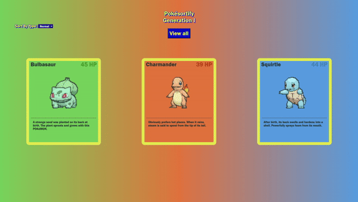

# Pokésortify

 

Pokésortify is a dynamic web application designed to sort Pokémon based on their types and to display them as cards. Pokésortify utilizes a full RESTful API linked to an extensive database detailing everything about the Pokémon main game series. It fetches the types of Pokémon to populate a dropdown menu and subsequently fetches the respective Pokémon of that type as well as the english description of that Pokémon. 

## Deployment

- This application is hosted on <a href="https://vercel.com/" target="_blank">Vercel</a>.
- The deployed website can be accessed <a href="https://pokesortify.vercel.app/" target="_blank">here</a>.

## Tech Stack

  

## Project Objectives

### Using REST APIs to integrate data in web apps

The main goal of this project is to develop proficiency in handling JSON data by utilizing the fetch API, while employing Promises with the syntax of async/await.

## Features

### Sort by type
 

### View all
 

## Project Challenges

I found myself writing extensive code within my try-catch blocks while fetching data. Since this syntax was unfamiliar to me, I was uncertain about the best practices to follow.

## Project Takeaways

As I became more familiar with the syntax and the process of fetching data, I modularized my code to handle data more efficiently. Additionally, I gained proficiency in parsing JSON by visually inspecting its structure and understanding how to navigate deeply nested parts of the JSON data.

